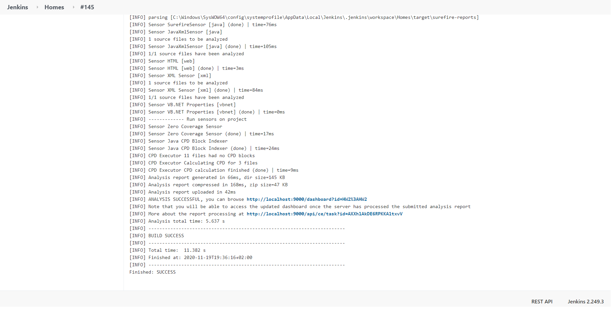

# Software Course Test-Driven Development ( TDD )
(TDD) is a software development process relying on software requirements being converted to test cases before software is 
fully developed, and tracking all software development by repeatedly testing the software against all test cases. This is 
as opposed to software being developed first and test cases created later.

## Introduction 
The project is a practical implementation of TDD using JAVA and cucumber ,filter search 
from fake database that return what the user needs.

## Project UML 

## Tests

## Sonarqube
Before refractor

After refractor

## Coverage

## Jenkin dashboard

## Output

